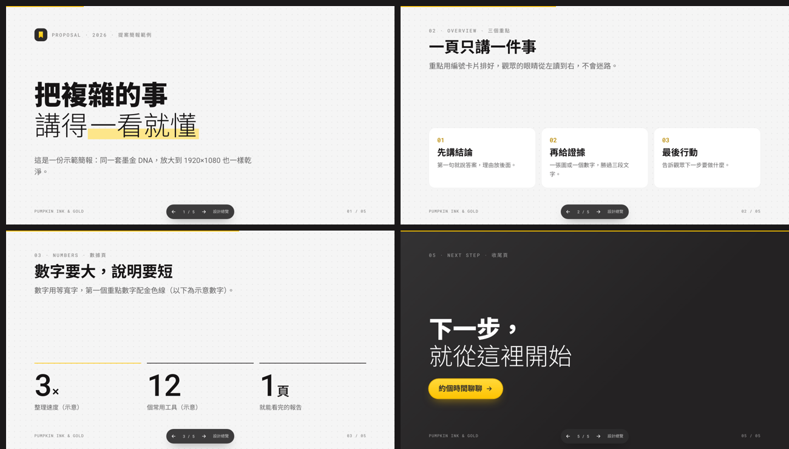

# 🖋️ 南瓜墨金美學 Pumpkin Ink & Gold

> **像一本排版講究的筆記本：墨色寫字、點格打底、金色只畫重點。**

一套可以直接拿來用的**設計 DNA**。做網站、網頁工具、平台、簡報、文件、社群圖卡，只要照著這份做，出來的東西就會長得像「同一家公司、同一個設計師」做的。

🔗 **線上設計總覽**：https://terry12260201.github.io/pumpkin-ink-gold/
🔗 **範例：中文工具目錄頁**：https://terry12260201.github.io/pumpkin-ink-gold/assets/demo-directory.html
🔗 **範例：簡報（←→ 翻頁）**：https://terry12260201.github.io/pumpkin-ink-gold/assets/demo-slides.html


---

## 📖 目錄

1. [這是什麼？](#-這是什麼)
2. [七個設計基因](#-七個設計基因)
3. [顏色](#-顏色)
4. [字體](#-字體)
5. [元件](#-元件)
6. [版面](#-版面)
7. [圖示、Logo、插圖](#-圖示logo插圖)
8. [動態](#-動態)
9. [要這樣做 ✅／不要這樣做 ❌](#-要這樣做--不要這樣做-)
10. [怎麼開始用](#-怎麼開始用)
11. [可以用在哪裡](#-可以用在哪裡)
12. [檔案地圖](#-檔案地圖)
13. [常見問題](#-常見問題)

---

## 🤔 這是什麼？

想像你走進一間很整齊的圖書館：

- 牆壁是**淡淡的米灰色**，上面有一點一點的小格子，像筆記本的紙。
- 書的標籤都用**同一支黑筆**寫，重要的寫深一點，不重要的寫淡一點。
- 整間館只有**一個金色的指示牌**，告訴你「從這裡開始」。
- 最重要的展區，燈光會暗下來，變成**深色的舞台**。

南瓜墨金美學就是把這種感覺，變成一套**顏色、字體、形狀、規則**。

**它適合**：知識平台、工具目錄、內部中控台、提案簡報、產品介紹頁——需要「清楚、可信、專業但不冷冰冰」的地方。

**它不適合**：兒童遊戲、手繪溫暖風、節慶活動（這些請用 🏝️ [南瓜暖島美學](https://github.com/terry12260201/pumpkin-cozy-isle)）。

---

## 🧬 七個設計基因

記住這七條，就抓到八成的感覺。

| # | 基因 | 一句話 | 為什麼這樣做 |
|---|---|---|---|
| 1 | 📄 **紙** | 淺灰底加小點格 | 像筆記本，看起來「被整理過」，又比純白不刺眼 |
| 2 | 🖋️ **墨** | 只用一種墨色，靠深淺分層 | 同一支筆寫的字，整頁才乾淨；換五種灰會髒 |
| 3 | ✨ **金** | 一個畫面只有一個金色 | 金色一多就沒有重點；只有一個，眼睛馬上知道要點哪 |
| 4 | 🔤 **字** | 大標題「一行超粗＋一行超細」 | 粗細對比讓標題有節奏，像雜誌封面 |
| 5 | 🗂️ **卡** | 白卡片＋細細的邊線＋18px 圓角 | 用線分區，不用厚陰影，畫面輕盈 |
| 6 | 🎭 **炭** | 重點段落變成深色舞台 | 淺色頁面裡突然變暗，眼睛自然停下來 |
| 7 | 🪶 **動** | 動作輕、快、小 | 滑過去卡片浮起一點點就好，不彈跳、不旋轉 |

---

## 🎨 顏色

### 主要顏色

| | 名字 | 色碼 | 用在哪裡 |
|---|---|---|---|
|  | 紙灰 Paper | `#F5F5F5` | 整個頁面的底色（加點格） |
|  | 卡白 Card | `#FFFFFF` | 卡片、輸入框 |
|  | 墨 Ink | `#161415` | 所有文字、選中的標籤 |
|  | 炭 Night | `#2D2B2C` | 導覽列、深色舞台、深色按鈕 |
|  | 深炭 Night Deep | `#242223` | 深色卡片 |
|  | 金 Gold | `#FDC302` | 唯一的主按鈕、焦點、第一條資料線 |
|  | 亮金 Gold Light | `#FFD83A` | 金色按鈕的漸層上端 |
|  | 深金 Gold Deep | `#B88800` | 白底上要寫金色字時用這個 |

### 墨色的深淺（最重要的觀念）

整套只有**一個墨色 `#161415`**，靠「透明度」變出不同層級：

| 透明度 | 用在哪裡 | 例子 |
|---:|---|---|
| **100%** | 標題、重要文字 | 卡片標題「會議紀錄整理」 |
| **65%** | 內文、描述 | 卡片下面那兩行說明 |
| **45%** | 小標籤、時間、計數 | 「文件」「2026-09-17」 |
| **18%** | 滑鼠移上去的邊框 | hover 時卡片邊線變深一點 |
| **8%** | 卡片邊線、分隔線 | 平常卡片那條很細的線 |

### 點綴色（少量使用）

| | 名字 | 色碼 | 用在哪裡 |
|---|---|---|---|
|  | 螢光黃 | `#FDE68A` | 重點文字的螢光筆底 |
|  | 珊瑚粉 | `#FDA4AF` | 插圖方塊 |
|  | 天空藍 | `#BAE6FD` | 插圖方塊 |
|  | 圖表藍 | `#4D6BFE` | 圖表第四條線、進度條 |
|  | 成功綠 | `#059669` | ✓ 打勾 |
|  | 警示紅 | `#DC2626` | ✗ 打叉、刪除 |

### 金色的三條規矩

1. **一個畫面只放一個金色主角**（通常是最重要的按鈕）。
2. 金色上面的字用**深炭色**，不用白色（白字在金底上看不清楚）。
3. 白底上要寫金色字，改用**深金 `#B88800`**（亮金在白底上太淡）。

---

## 🔤 字體

| 角色 | 英文數字 | 中文 | 用在哪裡 |
|---|---|---|---|
| **主字體** | Roboto | 思源黑體（Noto Sans TC） | 標題、內文、按鈕 |
| **等寬字** | Roboto Mono | 思源黑體 | 小眉標、數字、日期、頁碼 |

三支字體都是 Google 免費字體，可以商用。

### 招牌大標：一行超粗＋一行超細

```
每天用得到的          ← 900 超粗
AI 工具，都在這       ← 300 超細
```

### 字的大小

| 名稱 | 大小 | 粗細 |
|---|---:|---|
| 招牌大標 | 62px（手機 38） | 900＋300 |
| 頁面標題 | 40px | 600 |
| 區段標題 | 36px | 600 |
| 卡片標題 | 17px | 600 |
| 內文 | 16px | 400 |
| 卡片描述 | 14px | 400 |
| 標籤 | 12px | 500 |
| 眉標 | 12px 等寬、全大寫、字距拉開 | 500 |

### ⚠️ 中文要特別注意的三件事

| 規則 | 為什麼 |
|---|---|
| **中文不要斜體** | 中文字沒有設計斜體，電腦硬把它拗斜會很醜。要強調就用**螢光筆底**。 |
| **中文字距不要縮** | 英文標題會把字距縮緊，中文縮了會擠成一團。 |
| **中文行距要大一點** | 中文筆畫多，內文行高用 1.75 才好讀。 |

> 小眉標用「英文代碼＋中文」混著寫，例如 `01 · TOOLKIT · 工具包`，中文頁面也能保有「系統標籤」的味道。

---

## 🧩 元件


| 元件 | 長什麼樣子 | 規矩 |
|---|---|---|
| **浮動導覽列** | 深炭色的膠囊，浮在頁面最上面 | 右邊一顆小金色按鈕 |
| **按鈕** | 膠囊形狀，高 44px | 金色（主要）／炭色（次要）／白色（一般）／外框（深色區用） |
| **篩選膠囊** | 一排小膠囊，右邊有淡淡的數字 | 選中＝黑底白字；「全部」放第一個 |
| **工具卡** | 左邊一個 Logo 方塊，右邊標題＋兩行說明＋小標籤 | 說明固定兩行，卡片才會一樣高 |
| **搜尋框** | 白色、圓角、左邊放大鏡 | 點進去時出現金色光圈 |
| **數據卡** | 小圖示＋大數字＋一行說明 | 數字用等寬字 |
| **便當格** | 上面是有格線的插圖區，下面是文字 | 一排三格時，第一格用深色 |
| **深色舞台** | 深炭色、大圓角的區塊 | 一頁最多兩塊，用在收尾或常見問題 |
| **標籤／徽章** | 小小的膠囊 | 淡灰底＝分類；黑底＝新；金底＝精選 |
| **進度條** | 6px 高的圓頭長條 | 金色、炭色、藍色三種 |

---

## 📐 版面

| 項目 | 數值 |
|---|---|
| 一般頁面寬 | 1100px |
| 目錄頁、平台寬 | 1280px |
| 文章寬 | 720px |
| 卡片之間 | 14px |
| 區段之間 | 96px（手機 64px） |
| 卡片圓角 | **18px** |
| 深色舞台圓角 | 32px |
| 卡片邊線 | 1px，墨色 8% |

**分層靠線，不靠影子。** 平常卡片沒有陰影，只有「浮在上面的東西」才有影子：導覽列、深色舞台、滑鼠移上去的卡片。

---

## 🧭 圖示、Logo、插圖

### 圖示
- **線條圖示**，線寬 2px，端點圓圓的，只用一個顏色。
- 推薦 [Lucide](https://lucide.dev)（免費、可商用）。
- ❌ 不要用彩色 emoji 當按鈕圖示。

### Logo
1. 符號要**簡單到縮成 16px 還認得出來**。
2. **金色符號配深炭底**，或**墨色符號配紙底**，二選一。
3. 英文字標可以用超粗斜體；中文字標用超粗正體，不斜。

> 這套風格自己的標誌：深炭圓角方塊裡放一個**金色書籤**＝「挑選、收藏、整理好」。

### 插圖
公式是 **墨線角色 ＋ 漂浮圖示方塊 ＋ 金色細線**：
- 角色：黑色手繪線條、白色填色、不上顏色（要用**自己原創**的角色）。
- 圖示方塊：圓角方塊、稍微歪一點、有一點立體感，顏色從金／淡藍／淡粉／白／深炭挑。
- 金色細線：從中間往外連，兩端慢慢變透明。

---

## 🪶 動態

| 情況 | 動作 | 時間 |
|---|---|---|
| 滑鼠移到按鈕 | 往上浮 1px | 0.2 秒 |
| 滑鼠移到卡片 | 往上浮 2px、邊線變深、出現淡陰影 | 0.2 秒 |
| 文字變色 | 淡入 | 0.12 秒 |
| 內容捲動進場 | 從下方 14px 滑上來＋淡入 | 0.62 秒 |

❌ 不彈跳、不旋轉、不閃爍。使用者電腦設定「減少動態」時，動畫會自動關掉。

---

## ✅ 要這樣做 ／ ❌ 不要這樣做

| ✅ 要 | ❌ 不要 |
|---|---|
| 淺灰點格底 | 純白底、彩色漸層底 |
| 一種墨色分深淺 | 五六種不同的灰 |
| 一個畫面一個金色 | 金色到處都是 |
| 金底配深炭字 | 金底配白字 |
| 大標一粗一細 | 整頁都一樣粗 |
| 中文用螢光筆強調 | 中文用斜體 |
| 白卡＋細線＋18px 圓角 | 厚陰影、粗邊框、圓角大小不一 |
| 重點段落用深色舞台 | 整頁都是深色 |
| 單色線條圖示 | 彩色 emoji 當圖示 |
| 動作輕輕的 | 彈跳、旋轉、霓虹光 |

---

## 🚀 怎麼開始用

### 方法 1：直接複製 CSS（做網頁最快）

1. 打開 [`references/ink-gold.css`](references/ink-gold.css)，全部複製。
2. 貼進你網頁的 `<style>` 裡。
3. 把 `<html>` 改成 `<html lang="zh-Hant">`，`<body>` 改成 `<body class="ig">`。
4. 照 [`index.html`](index.html) 或 [`assets/demo-directory.html`](assets/demo-directory.html) 裡的寫法組元件。

```html
<a class="ig-btn ig-btn--gold" href="#">立即開始</a>
<a class="ig-btn ig-btn--ink" href="#">看全部</a>

<div class="ig-pills">
  <button class="ig-pill is-active">全部 <span class="ig-pill__n">12</span></button>
  <button class="ig-pill">文件 <span class="ig-pill__n">3</span></button>
</div>
```

### 方法 2：交給 Claude（裝成 skill）

```bash
git clone https://github.com/terry12260201/pumpkin-ink-gold ~/.claude/skills/pumpkin-ink-gold
```

之後跟 Claude 說「**用墨金美學幫我做一個……**」，它就會自動照這套規範做。

### 方法 3：交給其他 AI（ChatGPT、Gemini、Cursor……）

打開 [`references/AI咒語.md`](references/AI咒語.md)，複製咒語，在最後面寫上你要做的東西。把 `ink-gold.css` 一起貼過去效果最好。

---

## 🌱 可以用在哪裡



| 用途 | 怎麼套 | 詳細做法 |
|---|---|---|
| 🌐 **官網、產品介紹頁** | 浮動導覽列＋一粗一細大標＋深色舞台收尾 | [應用食譜 §1](references/應用食譜.md) |
| 🗂️ **目錄網站**（工具庫、課程庫、作品集） | 搜尋＋篩選膠囊＋工具卡網格 | [§2](references/應用食譜.md)、[範例頁](assets/demo-directory.html) |
| 🛠️ **網頁小工具** | 窄版面＋白卡輸入區＋一顆金色執行鈕 | [§3](references/應用食譜.md) |
| 🎛️ **平台、中控台、儀表板** | 卡片目錄當入口、數據卡、夜間版 | [§4](references/應用食譜.md) |
| 🎞️ **簡報**（HTML／Google 簡報／PowerPoint） | 點格底、等寬頁碼、深色收尾頁 | [§5](references/應用食譜.md)、[範例簡報](assets/demo-slides.html) |
| 📄 **文件、報告、提案書** | 封面金線、左側金條重點框、等寬數字 | [§6](references/應用食譜.md) |
| 📱 **社群圖卡、YouTube 縮圖、輪播** | 知識卡（紙底）＋封面卡（炭底＋金膠囊） | [§7](references/應用食譜.md) |
| ✉️ **電子報** | 600px 白卡＋金色按鈕＋深炭頁尾 | [§8](references/應用食譜.md) |
| 🎟️ **活動頁、報名頁** | 等寬日期眉標＋時間軸＋深色報名區 | [§9](references/應用食譜.md) |
| 🪪 **名片、識別證、貼紙** | 紙白正面＋深炭背面＋金色符號 | [§10](references/應用食譜.md) |
| 🥽 **XR／VR／遊戲選單** | 夜間版面板＋金色焦點框（Unreal Engine 預設字就是 Roboto） | [§11](references/應用食譜.md) |
| 📊 **圖表** | 金色主線＋淡金面積＋等寬數字 | [§12](references/應用食譜.md) |
| 🖼️ **AI 生圖** | 墨線角色＋漂浮圖示方塊 | [§13](references/應用食譜.md)、[AI咒語](references/AI咒語.md) |

---

## 🗺️ 檔案地圖

```
pumpkin-ink-gold/
├── README.md                 ← 你正在看的說明（給人看）
├── SKILL.md                  ← 給 Claude 看的規範
├── index.html                ← 設計總覽板（點色塊可複製色碼）
├── references/
│   ├── ink-gold.css          ← ⭐ CSS 套件，直接複製就能用
│   ├── 色彩與字體.md          ← 全部色碼、字級、中文排版規則
│   ├── 元件與版面.md          ← 每個元件的尺寸、狀態、頁面骨架
│   ├── 應用食譜.md            ← 網站／簡報／文件／社群／XR 各怎麼做
│   └── AI咒語.md              ← 複製給其他 AI 用的咒語＋生圖咒語
├── assets/
│   ├── demo-directory.html   ← 範例：中文工具目錄頁（搜尋、篩選能用）
│   └── demo-slides.html      ← 範例：16:9 簡報（←→ 翻頁）
├── docs/                     ← README 用的圖片
└── scripts/inline_kit.py     ← 改了 CSS 套件後，同步到所有 HTML
```

所有 HTML 都是**單一檔案**，下載後雙擊就能打開。

---

## ❓ 常見問題

**Q：沒有網路的時候，字體會跑掉嗎？**
A：會自動換成電腦裡的字（Mac 用蘋方、Windows 用微軟正黑），版面不會壞。只是蘋方最粗到 600，大標的「超粗」會變成「粗」。

**Q：我可以改金色嗎？**
A：可以，改 CSS 最上面的 `--ig-gold` 那幾行就好。但「一個畫面只有一個重點色」這條規矩要留著，那才是這套風格的靈魂。

**Q：可以做深色版嗎？**
A：可以。`<body class="ig" data-theme="night">` 就會切成夜間版，適合中控台和 XR 介面。

**Q：跟南瓜暖島美學差在哪？**
A：暖島是**手繪水彩、遊戲感、溫暖**；墨金是**乾淨、專業、編輯感**。對內玩心用暖島，對外專業用墨金。

---

<sub>🖋️ 南瓜墨金美學 v1.0 · 2026-09-17 · 由 南瓜虛擬科技 陳南宏（南瓜）整理 · 字體：Roboto／Roboto Mono／Noto Sans TC（Google Fonts 開源授權，可商用）· 圖示建議：Lucide（開源授權，可商用）</sub>
