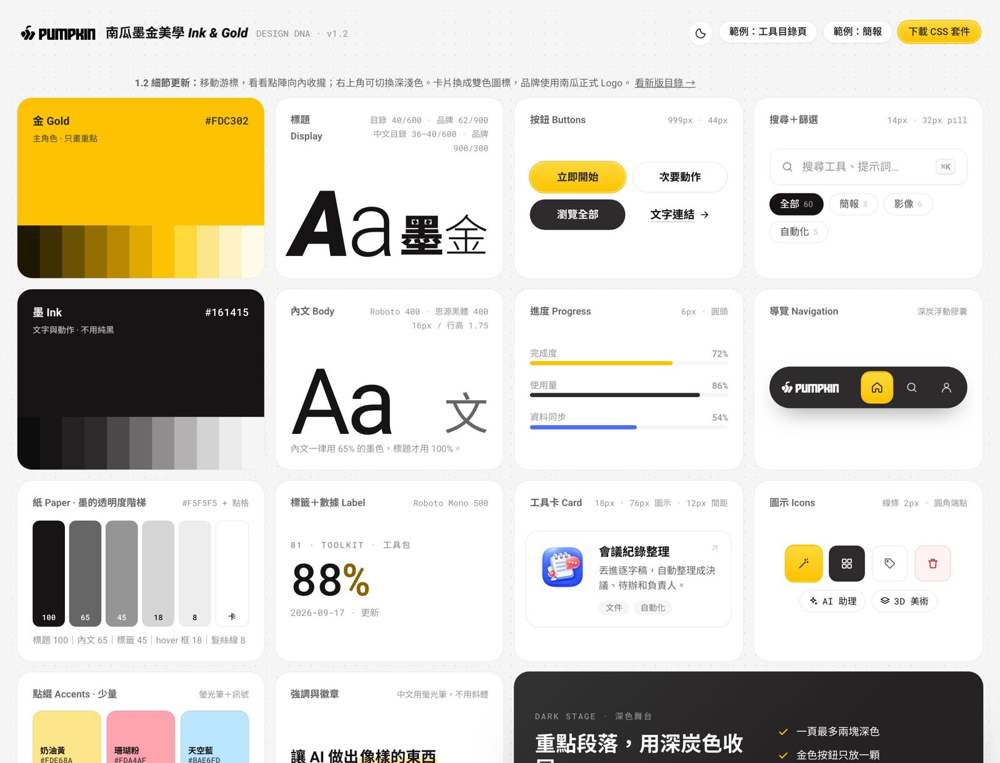
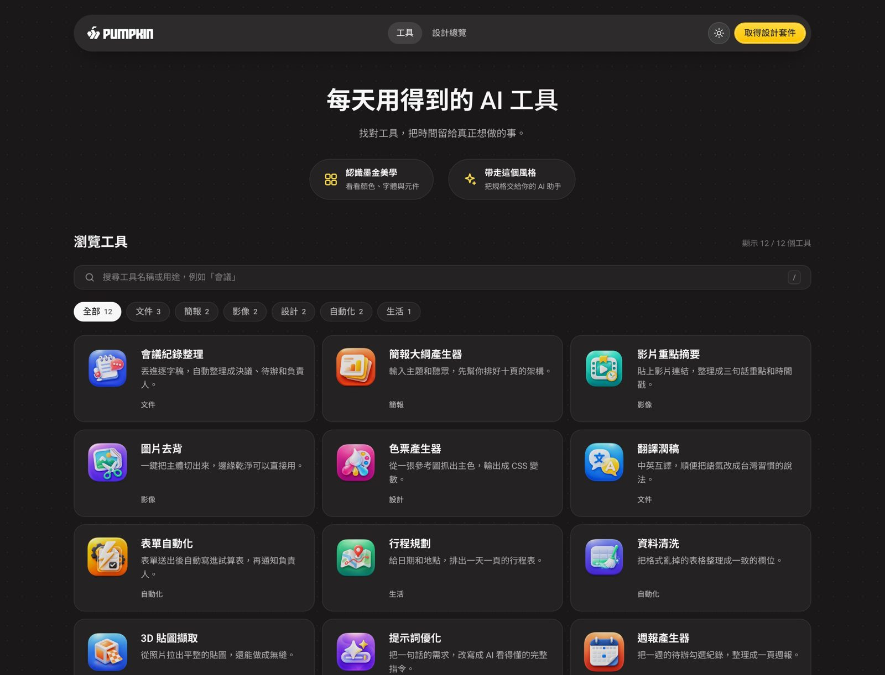
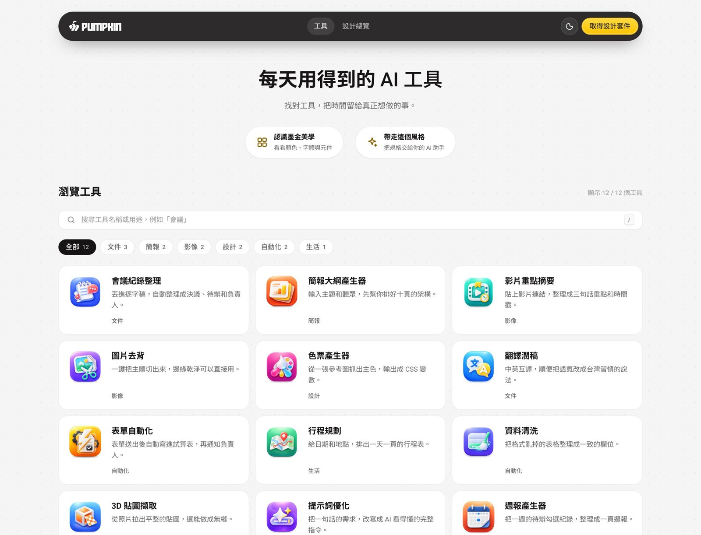

# 南瓜墨金美學 · Pumpkin Ink & Gold

**淡紙承載內容，墨字建立順序，金色指出下一步。**

一套可以帶去網站、工具、平台、簡報與文件的中文設計語言。就像把桌面收乾淨：重要的東西看得見，需要的東西找得到。

[看設計總覽](https://terry12260201.github.io/pumpkin-ink-gold/) · [試試中文工具目錄](https://terry12260201.github.io/pumpkin-ink-gold/assets/demo-directory.html) · [看簡報示範](https://terry12260201.github.io/pumpkin-ink-gold/assets/demo-slides.html) · [取得 CSS](references/ink-gold.css)



## 把手感也補齊

移動滑鼠，小點會向內靠攏；停在按鈕上，附近的點會沿著按鈕輪廓聚過來。滑鼠離開，再排回整齊的網格。這是會回應操作的背景，不是一張不動的點點壁紙。

右上角可切換淺色與深色，下次打開會記住選擇。小螢幕與「減少動態」設定保留安靜的靜態背景。

卡片使用統一比例的雙色圖標，Logo換成南瓜正式品牌檔。品牌Logo認公司、主題圖標認用途、操作圖示認動作，各有自己的位置。



## 先看它的個性

| 元素 | 看起來如何 | 為什麼這樣做 |
|---|---|---|
| 紙 | 淺灰背景、很淡的點格 | 像一本能放心做筆記的本子 |
| 墨 | 暖黑文字，深淺有順序 | 先讀標題，再讀摘要 |
| 金 | 少量亮金，只點出重點 | 像螢光筆，不把整頁塗滿 |
| 卡 | 白色、細邊、18px圓角 | 每件東西有自己的位置 |
| 圖 | 小而清楚的Logo或主題圖示 | 還沒讀字，就先認出用途 |
| 字 | 中文端正、字距自然、行高舒服 | 看久一點也不擠 |
| 動 | 小點向游標與按鈕輪廓收攏 | 輕輕回應你，不打斷閱讀 |

## 色票，像文具盒一樣簡單

| 顏色 | 色碼 | 用途 |
|---|---|---|
|  紙 | `#F5F5F5` | 頁面底 |
|  白 | `#FFFFFF` | 卡片與輸入框 |
|  墨 | `#161415` | 主要文字 |
|  炭 | `#2D2B2C` | 導覽與深色段落 |
|  金 | `#FDC302` | 主要動作 |

金色按鈕從 `#FDC302` 漸變到 `#FFD83A`，上面放深炭字。一般摘要使用65%墨色。重要小字另外提高對比，不只追求「看起來很淡」。

## 目錄模式：最接近本次參考頁的版本



桌面像一面整齊的索引牆，手機變成一列卡片。每張卡都照同一個順序：**識別圖 → 名稱 → 用途 → 分類**。

| 項目 | 規格 | 白話說明 |
|---|---|---|
| 內容寬 | 1200px | 不讓文字鋪滿整個螢幕 |
| 網格 | 桌面3欄、平板2欄、手機1欄 | 螢幕小了就少排幾張 |
| 卡片間距 | 12px | 卡片靠近，但不擠在一起 |
| 卡片內距 | 16px | 文字不貼邊 |
| 卡片圓角 | 18px | 柔和，但不軟趴趴 |
| 識別圖 | 桌面76px；手機64px | 讓每張卡一眼分得出來 |
| 大標 | 桌面36–40px；手機30px | 說清楚這裡有什麼 |
| 卡片字 | 標題17px；摘要14px | 先大後小，容易掃讀 |
| 滑過 | 上移1px、200ms | 輕輕回應你的滑鼠 |

**1.1 的重要修正：目錄不必有巨大宣傳標題、四張數據卡或大插畫。** 這些元素有需要才放；讓讀者快點找到內容，比裝滿畫面重要。

## 中文怎麼保持同樣的感覺

英文用 Roboto，中文用 Noto Sans TC；字體不可用時退回蘋方或微軟正黑體。中文不斜、不壓字距，摘要行高1.6–1.75。

英文工具名常常很短，中文文章名可能很長。因此中文卡片可以保留兩行標題，而不是把字縮小。不同裝置的字體會略有差異，正式交付仍需看實際畫面。

## 可以用在哪裡

| 想做什麼 | 怎麼延伸 |
|---|---|
| 工具目錄、資源網站 | 小Logo＋用途摘要＋分類搜尋 |
| 知識平台、學習書架 | 主題圖示＋文章摘要＋閱讀時間 |
| 工作平台、儀表板 | 工作狀態優先，金色指向下一步 |
| 網頁小工具 | 左邊輸入、右邊結果；保持同一套按鈕與表單 |
| 品牌／產品介紹 | 可以用大標、原創插畫、深色段落講故事 |
| 簡報／課程教材 | 一頁一個重點，金色標出關鍵數字 |
| 文件／提案／操作手冊 | 標題、表格與步驟清楚，列印時省略點格 |
| 電子報／社群圖卡 | 保留紙、墨、金與短標題，不硬塞整張網頁 |
| 展示資訊／觸控介面 | 放大按鈕與文字，依觀看距離測試 |

同一套風格可以換骨架。目錄方便找，品牌頁方便理解，簡報方便跟著聽。

## 拿去用，只要三步

1. 先讀 [design.md](design.md)，決定要用哪種版型。
2. 引入 [CSS套件](references/ink-gold.css)，中文頁設定 `lang="zh-Hant"`。
3. 參考 [工具目錄範例](assets/demo-directory.html)，換成你的內容。

```html
<html lang="zh-Hant">
<link rel="stylesheet" href="references/ink-gold.css">
<body class="ig ig-directory">
  <button class="ig-theme-toggle" data-ig-theme-toggle aria-label="切換深色模式"></button>
  <!-- 你的導覽、導讀、分類與卡片 -->
  <script src="references/ink-gold-ui.js"></script>
</body>
</html>
```

目錄用 `ig ig-directory`；品牌模式用 `ig`。整包攜帶HTML、CSS、JS與圖示可保留完整外觀；若要單檔，需再內嵌CSS、JS與SVG，字體使用本機備援。file://尚未完成實機驗證。

## 給 Claude、Codex 或其他 AI

把 [SKILL.md](SKILL.md)、[design.md](design.md) 和 CSS／JS 一起提供，說：

> 用「南瓜墨金美學」的目錄模式幫我做＿＿。保留三欄橫卡、76px識別圖、互動點格、深淺切換與中文閱讀層級，內容使用我提供的資料。

完整版本在 [AI咒語](references/AI咒語.md)。Claude可安裝到 `~/.claude/skills/pumpkin-ink-gold`；Codex可安裝到 `~/.codex/skills/pumpkin-ink-gold`。修改套件後執行 `python3 scripts/inline_kit.py` 更新內嵌範例。

## 這裡有哪些檔案

| 檔案 | 看什麼 |
|---|---|
| [SKILL.md](SKILL.md) | AI怎麼選模式、如何實作與檢查 |
| [design.md](design.md) | 實測尺寸、設計方向、中文轉換 |
| [色彩與字體](references/色彩與字體.md) | 色碼與文字規格 |
| [元件與版面](references/元件與版面.md) | 按鈕、卡片、搜尋與各種組合 |
| [應用食譜](references/應用食譜.md) | 延伸到不同媒介 |
| [互動腳本](references/ink-gold-ui.js) | 磁吸點陣、深淺切換與動態降級 |
| [驗證紀錄](docs/verification.md) | 本次實際檢查的範圍與限制 |

## 來源與界線

本版以使用者指定的 [公開工具目錄](https://godofprompt.ai/best-ai-tools) 為視覺參考，2026-09-17實際量測；觀察值和中文版調整分別記在 [design.md](design.md)。風格名與中文內容採南瓜版本，不含對方商標或原站程式碼。2026-09-18補查實際點陣互動並獨立實作。主題圖使用 [Phosphor Icons](https://github.com/phosphor-icons/core) 的MIT授權Duotone素材，配色與底座為本套件調整，詳見 [圖示來源與授權](assets/icons/SOURCES.md)。南瓜Logo來源見 [品牌紀錄](assets/brand/SOURCES.md)。

工具目錄中的12項為設計示範，點擊會開啟說明；不是12項已完成的工具服務。簡報是HTML示範，不是PPTX檔。

南瓜墨金美學 · 南瓜虛擬科技
