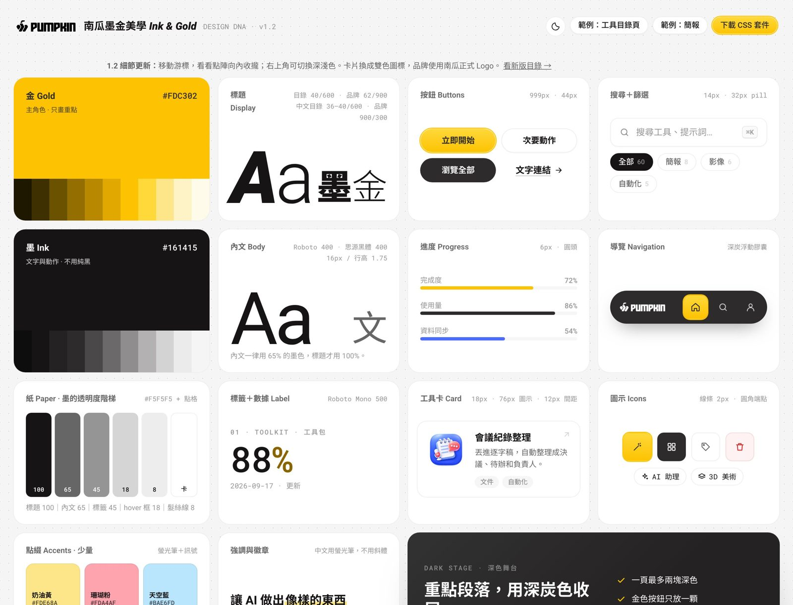
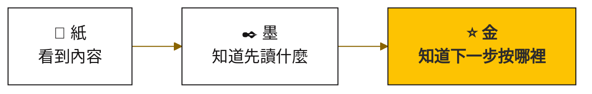
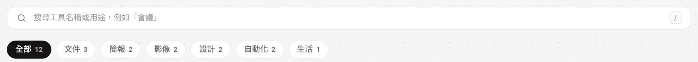
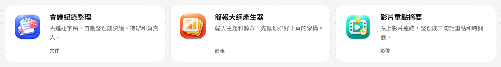
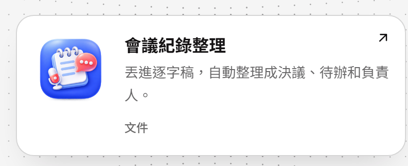
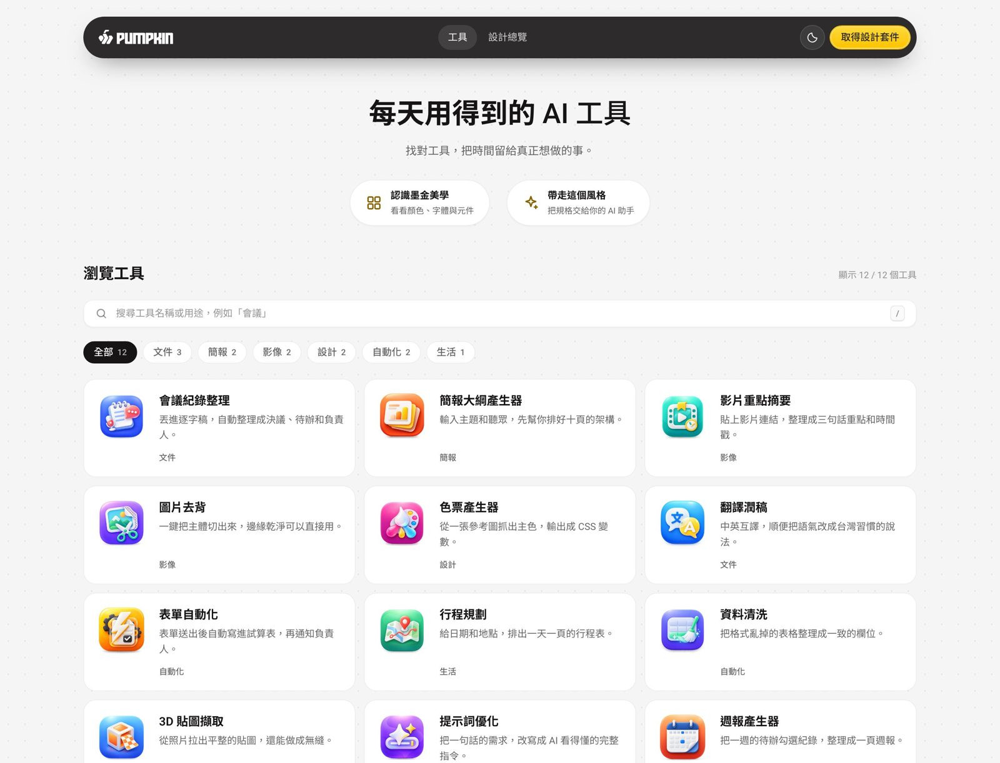
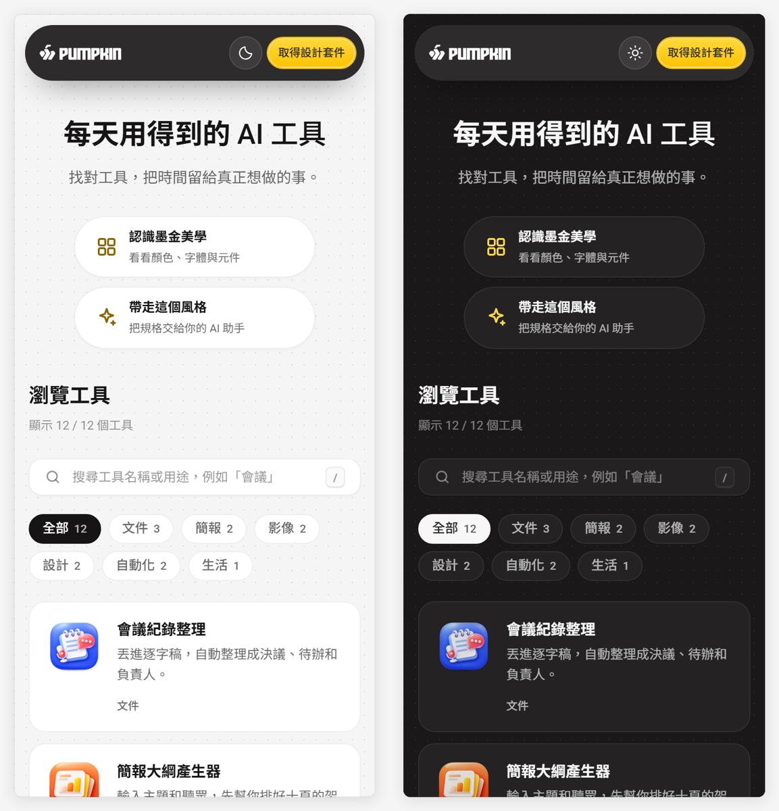
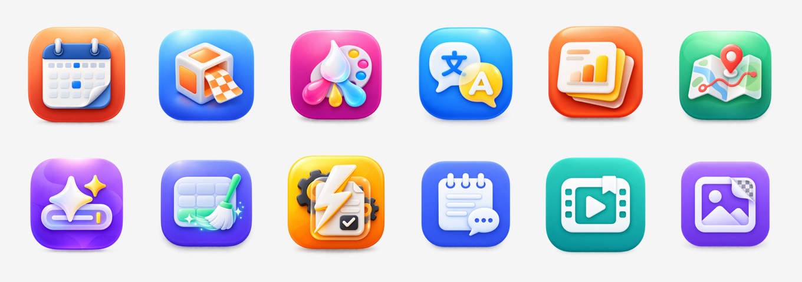
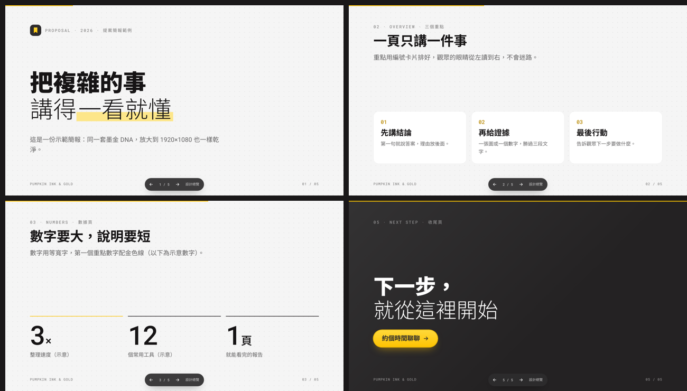
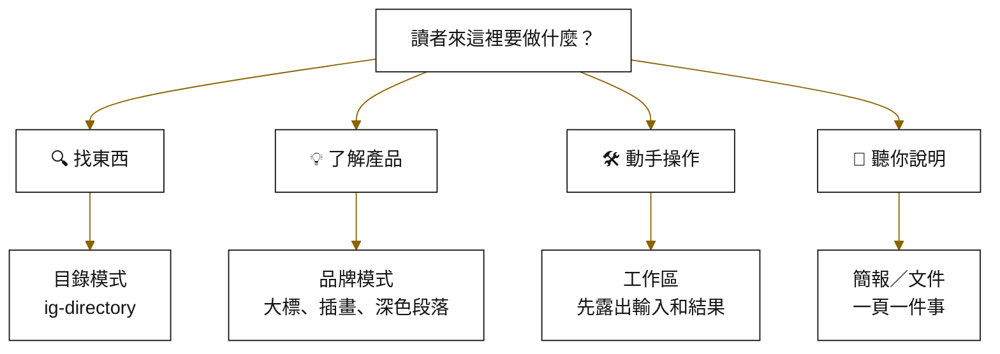

<picture>
  <source media="(prefers-color-scheme: dark)" srcset="docs/readme/banner-dark.svg">
  
</picture>

<h1 align="center">🖋️ 南瓜墨金美學 · Pumpkin Ink & Gold</h1>

<p align="center"><b>淡紙承載內容，墨字建立順序，金色指出下一步。</b><br>一套可以帶去網站、工具、平台、簡報與文件的中文設計語言。</p>

<p align="center">
  <a href="https://terry12260201.github.io/pumpkin-ink-gold/"></a>
  
  
  
</p>

<p align="center">
  <a href="https://terry12260201.github.io/pumpkin-ink-gold/">設計總覽</a> •
  <a href="https://terry12260201.github.io/pumpkin-ink-gold/assets/demo-directory.html">工具目錄範例</a> •
  <a href="https://terry12260201.github.io/pumpkin-ink-gold/assets/demo-slides.html">簡報範例</a> •
  <a href="references/ink-gold.css">取得 CSS</a>
</p>

---

## 📌 目錄

- [這是什麼](#-這是什麼)
- [三個角色：紙、墨、金](#-三個角色紙墨金)
- [會回應你的背景：磁吸點陣](#-會回應你的背景磁吸點陣)
- [色票](#-色票)
- [字體與中文排版](#-字體與中文排版)
- [元件長什麼樣](#-元件長什麼樣)
- [目錄模式](#-目錄模式)
- [圖示風格](#-圖示風格)
- [簡報模式](#-簡報模式)
- [先選版型，再上色](#-先選版型再上色)
- [三步開始用](#-三步開始用)
- [交給 AI 來做](#-交給-ai-來做)
- [檔案清單](#-檔案清單)
- [給接手的 AI](#-給接手的-ai)

---

## 📖 這是什麼

以前每做一個新網站或工具，配色、字體、按鈕長相都要重講一次，做出來還常常不像同一套。墨金美學把這些固定下來：**一份規範、一支 CSS、一支互動腳本**，交給設計師或 AI，做出來就會像同一個人的作品。

它的感覺像一張收乾淨的桌面：淺灰的紙、深色的字、一點點金色。重要的東西看得見，需要的東西找得到，不會被花俏的裝飾搶走注意力。

<picture>
  <source media="(prefers-color-scheme: dark)" srcset="docs/overview-dark.jpg">
  
</picture>
<p align="center"><sub>▲ 設計總覽頁：色票、字體、按鈕、卡片、導覽列一次看完（GitHub 切深色模式會看到夜間版）</sub></p>

---

## 🟡 三個角色：紙、墨、金

把顏色當成工作分配，每個顏色只做一件事：

| 角色 | 色碼 | 負責什麼 | 白話比喻 |
|---|---|---|---|
| **紙** | `#F5F5F5` | 承載內容：頁面底色＋淡淡的點格 | 一本可以放心做筆記的本子 |
| **墨** | `#161415` | 建立順序：標題最深，摘要淡一點，小字再淡一點 | 先讀標題，再讀摘要 |
| **金** | `#FDC302` | 指出下一步：主要按鈕、關鍵數字 | 螢光筆，只畫重點，不把整頁塗滿 |


```mermaid
%%{init: {'theme':'base','themeVariables':{'fontFamily':'PingFang TC, Microsoft JhengHei, Noto Sans TC, sans-serif','primaryColor':'#FFFFFF','primaryTextColor':'#161415','primaryBorderColor':'#161415','lineColor':'#8A6400','tertiaryColor':'#F5F5F5'}}}%%
flowchart LR
  A["📄 紙<br>看到內容"] --> B["✒️ 墨<br>知道先讀什麼"] --> C["⭐ 金<br>知道下一步按哪裡"]
  classDef gold fill:#FDC302,stroke:#161415,color:#2D2B2C,font-weight:bold
  class C gold
```

> [!IMPORTANT]
> **金色一個畫面只放一個重點。** 相鄰的區塊不要同時出現兩顆金色主按鈕；金底上的字一律用深炭色 `#2D2B2C`，不用白字。

---

## 🧲 會回應你的背景：磁吸點陣

墨金的背景不是一張不會動的點點壁紙。移動滑鼠，附近的小點會往游標靠過去；停在按鈕上，點會沿著按鈕的輪廓聚攏；滑鼠離開，又排回整齊的網格。

<p align="center">
  
  <br><sub>▲ 實際錄製：滑鼠停在按鈕上，點會貼著按鈕邊緣收攏</sub>
</p>

| 設定 | 效果 | 什麼時候用 |
|---|---|---|
| 磁吸版（預設） | 點往游標靠，沿按鈕輪廓收攏 | 一般網站、目錄、工具頁 |
| `data-dots="glow"` | 點只變亮，不移動 | 想要更安靜的頁面 |
| 手機（≤768px） | 自動改成靜態點格 | 手機沒有滑鼠，省電 |
| 系統開啟「減少動態」 | 自動改成靜態點格 | 尊重容易暈眩的使用者 |

> [!NOTE]
> 點格只用灰色，**不用金色**。背景負責氣氛，金色留給真正要按的東西。表格、列印文件、資料很密的區塊可以不放點格。

---

## 🎨 色票

### 主色

| | 名稱 | 色碼 | 用途 |
|:---:|---|---|---|
|  | 紙 | `#F5F5F5` | 頁面底色 |
|  | 卡 | `#FFFFFF` | 卡片、輸入框 |
|  | 墨 | `#161415` | 標題、主要文字 |
|  | 炭 | `#2D2B2C` | 深色導覽列、金底上的文字 |
|  | 金 | `#FDC302` | 主要按鈕、重點 |
|  | 淺金 | `#FFD83A` | 金色按鈕漸層的上緣 |
| — | 深金 | `#8A6400` | 淺底上的金色小字，比亮金好讀 |

### 輔助色（少量點綴）

| | 名稱 | 色碼 | 用途 |
|:---:|---|---|---|
|  | 淡黃 | `#FDE68A` | 標記、提醒底色 |
|  | 粉 | `#FDA4AF` | 標籤 |
|  | 藍 | `#BAE6FD` | 標籤 |
|  | 成功 | `#059669` | 完成、通過 |
|  | 危險 | `#DC2626` | 錯誤、刪除 |
|  | 圖表藍 | `#4D6BFE` | 圖表的其中一色 |

### 夜間版

| | 名稱 | 色碼 |
|:---:|---|---|
| — | 紙 | `#1A1819` |
|  | 卡 | `#242223` |
| — | 主要文字 | `#F7F7F7` |

夜間版不是把畫面反相，而是重新挑過的一組顏色；切換深淺色時，資訊的順序不變。右上角按鈕切換，下次打開會記住你的選擇。

<details>
<summary><b>🔍 文字深淺怎麼分（墨色的透明度階梯）</b></summary>

| Token | 數值 | 用在哪 |
|---|---|---|
| `--ig-ink` | 墨 100% | 標題、主要內容 |
| `--ig-ink-muted` | 墨 65% | 一般說明、摘要 |
| `--ig-label-readable` | 墨 64% | 閱讀時間、分類等必要小字 |
| `--ig-ink-soft` | 墨 45% | 非必要的輔助資訊（不保證對比合格） |
| `--ig-ink-faint` | 墨 18% | 滑過時的邊線 |
| `--ig-ink-hairline` | 墨 8% | 卡片的細邊 |

重要的小字用 `--ig-label-readable`，不要只因為「看起來很淡很高級」就用 45%。
</details>

---

## 🔤 字體與中文排版

英文用 **Roboto**，中文用 **Noto Sans TC**；字體載不到時，退回蘋方（Mac）或微軟正黑體（Windows）。

```css
--ig-font-sans: "Roboto", "Noto Sans TC", "PingFang TC", "Microsoft JhengHei", -apple-system, sans-serif;
--ig-font-mono: "Roboto Mono", "SF Mono", Menlo, Consolas, "Noto Sans TC", monospace;
```

| 元素 | 桌面 | 手機 | 粗細／行高 |
|---|---:|---:|---|
| 目錄主標 | 36–40px | 30px | 600／1.3 |
| 區段標題 | 22px | 21–22px | 700／1.5 |
| 卡片標題 | 17px | 16–17px | 600／1.45 |
| 主導讀 | 16px | 14–16px | 400／1.75 |
| 卡片摘要 | 14px | 13–14px | 400／1.6–1.75 |
| 分類與狀態 | 12–14px | 12–13px | 400–500／1.5 |
| 品牌展示大標 | 可用 62px | 約 38px 起 | 900 搭 300 的粗細反差 |

中文有幾條專屬規則：

- **不斜、不壓字距**：中文用正體、字距 0。要強調就用粗細、位置或淡底。
- **長標題保留兩行**：英文工具名短，中文標題常常很長。寧可兩行，也不要把字縮小。
- **同一排卡片等高**：預留相同的標題和摘要高度，整排看起來才整齊。
- **等寬字只給編號和程式碼**：不要把整段中文摘要換成等寬字。

---

## 🧱 元件長什麼樣

所有元件都從同一個規則長出來：白卡、18px 圓角、1px 極淡的墨色細邊、幾乎沒有陰影。

**導覽列**：深炭色膠囊，左邊 Logo、中間分頁、右邊日夜切換和唯一的金色按鈕。

<p align="center"></p>

**搜尋與分類**：白色搜尋框加上快捷鍵提示 <kbd>/</kbd>，下面一排分類膠囊，選中的那顆變成墨底白字，數字告訴你每類有幾個。

<p align="center"></p>

**工具卡片**：每張卡照同一個順序排：**識別圖 → 名稱 → 用途 → 分類**。

<p align="center"></p>

<table>
  <tr>
    <td width="45%"></td>
    <td>
      <b>滑過卡片時</b><br><br>
      卡片往上浮 1px、邊線加深、右上角出現箭頭 ↗，整個過程 200 毫秒。<br><br>
      動作很小，只是讓你知道「這個可以點」，不會打斷閱讀。系統開啟「減少動態」時，位移會自動取消。
    </td>
  </tr>
</table>

<details>
<summary><b>📐 卡片與互動的完整規格</b></summary>

| 項目 | 規格 |
|---|---|
| 卡片圓角 | 18px |
| 卡片邊線 | 1px，墨色 8% |
| 卡片內距 | 16px |
| 圖文間距 | 16px |
| 識別圖 | 桌面 76px、手機 64px |
| 卡片間距 | 12px |

| 狀態 | 回應 |
|---|---|
| hover | 卡片上移 1px，邊線加深，約 200ms |
| focus（鍵盤） | 清楚的深色外框＋金色輔助圈 |
| 選中分類 | 墨底白字 |
| 沒有結果 | 說明沒找到，提供清除或換個搜尋方式 |
| 載入中 | 真的在等才顯示進度，不做假倒數 |
</details>

---

## 📂 目錄模式

這是墨金 1.2 最完整的版型，適合工具目錄、知識庫、資源平台。桌面像一面整齊的索引牆，平板兩欄，手機一欄。

<picture>
  <source media="(prefers-color-scheme: dark)" srcset="docs/directory-dark.jpg">
  
</picture>
<p align="center"><sub>▲ 工具目錄範例。<a href="https://terry12260201.github.io/pumpkin-ink-gold/assets/demo-directory.html">打開線上版</a>可以實際搜尋、篩選、切換日夜</sub></p>

| 項目 | 規格 | 白話說明 |
|---|---|---|
| 內容寬度 | 1200px | 不讓文字鋪滿整個螢幕 |
| 網格 | 桌面 3 欄、平板 2 欄、手機 1 欄 | 螢幕小了就少排幾張 |
| 卡片間距 | 12px | 靠近，但不擠 |
| 大標 | 桌面 36–40px、手機 30px | 說清楚這裡有什麼 |

<table>
  <tr>
    <td width="48%"></td>
    <td>
      <b>手機上也成立</b><br><br>
      寬度 ≤ 640px 時變成單欄、左右留 16px。兩顆入口按鈕改成上下排，分類膠囊自動換行，不會被切掉。<br><br>
      已實測 320、375、414、768、1440px 五種寬度，都沒有橫向捲動、按鈕被截斷或 Logo 被壓扁。
    </td>
  </tr>
</table>

> [!TIP]
> **目錄不需要巨大的宣傳標題、四張數據卡或大插畫**（這是 1.1 版的重要修正）。讓讀者快點找到內容，比裝滿畫面重要。

---

## 🧩 圖示風格

卡片上的識別圖，統一用 macOS 風格的圓角方塊：同一個顏色上亮下暗、中間一個大大的白色圖案、微微立體、不描邊。整排放在一起，就像一盒同款的圓角積木。

<p align="center"></p>

| 規則 | 說明 |
|---|---|
| 8 組底色 | 墨、金、靛藍、青綠、葡萄紫、珊瑚橘、草綠、紙白 |
| 墨色 ≤ 2 顆 | 只給最核心的系統類工具 |
| 金色 ≤ 1 顆 | 金色只做重點，圖示也一樣 |
| 白色主體佔 60% | 一眼認得出是什麼 |
| 相鄰不同色相 | 並排時不會糊成一片 |

完整規格和可以直接丟給 AI 生圖的英文 prompt，在 [圖示風格](references/圖示風格.md)。

> [!NOTE]
> **三種圖各有位置**：品牌 Logo 認公司、主題圖示認用途、單色線條圖示認動作，不要混著用。

---

## 📊 簡報模式

同樣的紙、墨、金，換成「一頁只講一件事」的節奏。金色用來標出關鍵數字或下一步。

<p align="center"></p>

<p align="center"><sub>▲ <a href="https://terry12260201.github.io/pumpkin-ink-gold/assets/demo-slides.html">打開線上簡報</a>，用左右方向鍵翻頁。這是 HTML 範例，不是 PPTX 檔</sub></p>

---

## 🧭 先選版型，再上色

顏色一樣，不代表每一頁骨架都一樣。先問：**讀者來這裡是要找東西、了解產品，還是聽你說明？**


```mermaid
%%{init: {'theme':'base','themeVariables':{'fontFamily':'PingFang TC, Microsoft JhengHei, Noto Sans TC, sans-serif','primaryColor':'#FFFFFF','primaryTextColor':'#161415','primaryBorderColor':'#161415','lineColor':'#8A6400','tertiaryColor':'#F5F5F5'}}}%%
flowchart TD
  Q["讀者來這裡要做什麼？"] --> A["🔍 找東西"] --> A1["目錄模式<br>ig-directory"]
  Q --> B["💡 了解產品"] --> B1["品牌模式<br>大標、插畫、深色段落"]
  Q --> C["🛠️ 動手操作"] --> C1["工作區<br>先露出輸入和結果"]
  Q --> D["🎤 聽你說明"] --> D1["簡報／文件<br>一頁一件事"]
```

| 想做什麼 | 怎麼延伸 |
|---|---|
| 工具目錄、資源網站 | 小 Logo＋用途摘要＋分類搜尋 |
| 知識平台、學習書架 | 主題圖示＋文章摘要＋閱讀時間 |
| 工作平台、儀表板 | 工作狀態優先，金色指向下一步；標題縮到 24–32px，不放宣傳大圖 |
| 網頁小工具 | 左邊輸入、右邊結果；同一套按鈕與表單 |
| 品牌、產品介紹 | 可以用 62px 大標、原創插畫、深色段落講故事 |
| 簡報、課程教材 | 一頁一個重點，金色標出關鍵數字 |
| 文件、提案、操作手冊 | 標題、表格、步驟清楚；列印時省略點格 |
| 電子報、社群圖卡 | 保留紙、墨、金與短標題，不硬塞整張網頁 |
| 展示資訊、觸控介面 | 放大按鈕與文字，依觀看距離測試 |

---

## 🚀 三步開始用

**1. 先讀規範**：打開 [design.md](design.md)，決定你要做目錄、品牌頁、工作區還是簡報。

**2. 引入套件**：把 CSS 和互動腳本放進你的頁面，中文頁記得設 `lang="zh-Hant"`。

```html
<html lang="zh-Hant">
<link rel="stylesheet" href="references/ink-gold.css">
<body class="ig ig-directory">
  <button class="ig-theme-toggle" data-ig-theme-toggle aria-label="切換深色模式"></button>
  <!-- 你的導覽、導讀、分類與卡片 -->
  <script src="references/ink-gold-ui.js"></script>
</body>
</html>
```

**3. 換成你的內容**：照 [工具目錄範例](assets/demo-directory.html) 的結構，把卡片換成你的資料。

**做對的話**，打開頁面會看到淺灰點格背景，移動滑鼠點會跟著動，右上角按鈕可以切日夜。

<details>
<summary><b>⚙️ 進階：class 怎麼選、網址參數、單檔打包</b></summary>

| 情境 | 寫法 |
|---|---|
| 目錄頁 | `<body class="ig ig-directory">` |
| 品牌頁 | `<body class="ig">` |
| 點格只發亮不移動 | `<body data-dots="glow">` |
| 用網址指定主題 | 在網址後面加 `?theme=night` 或 `?theme=day` |
| 已經有自己的主題切換 | `<script src="ink-gold-ui.js" data-theme="external">` |

整包帶著 HTML、CSS、JS 和圖示資料夾，就能保留完整外觀。要做成單一 HTML 檔，需要把 CSS、JS、SVG 內嵌進去，字體改用本機備援。修改 CSS 後執行下面這行，會同步更新總覽和範例頁：

```bash
python3 scripts/inline_kit.py
```
</details>

---

## 🤖 交給 AI 來做

把 [SKILL.md](SKILL.md)、[design.md](design.md) 和 CSS／JS 一起丟給 Claude、Codex 或其他 AI，然後說：

> 用「南瓜墨金美學」的目錄模式幫我做＿＿。保留三欄橫卡、76px 識別圖、互動點格、深淺切換與中文閱讀層級，內容使用我提供的資料。

完整的指令範本在 [AI咒語](references/AI咒語.md)。

| AI 工具 | 安裝位置 |
|---|---|
| Claude Code | `~/.claude/skills/pumpkin-ink-gold` |
| Codex | `~/.codex/skills/pumpkin-ink-gold` |

<details>
<summary><b>✅ 交付前的驗收清單（AI 和人都適用）</b></summary>

- [ ] 同一畫面分得清標題、摘要與狀態；圖片沒有搶過內容
- [ ] 1440、768、414、375、320px 都沒有橫向溢出、被截斷的操作或壓扁的 Logo
- [ ] 搜尋、分類、清空結果、卡片連結、鍵盤焦點都能用
- [ ] 實際移動滑鼠檢查：空白處收攏、按鈕邊緣吸附、離開回復（不能只看靜態截圖）
- [ ] 深淺色切換、重新整理後有記住、「減少動態」設定有生效
- [ ] 頁面保留真實資料，示意資料有標示清楚
</details>

---

## 📁 檔案清單

| 檔案 | 裡面有什麼 |
|---|---|
| [SKILL.md](SKILL.md) | 給 AI 的操作規則：怎麼選版型、怎麼實作、怎麼檢查 |
| [design.md](design.md) | 實測尺寸、設計方向、中文轉換的完整 DNA |
| [references/色彩與字體.md](references/色彩與字體.md) | 色碼、字級、中文排版 |
| [references/元件與版面.md](references/元件與版面.md) | 按鈕、卡片、搜尋、響應式與互動狀態 |
| [references/圖示風格.md](references/圖示風格.md) | 圓角方塊圖示規格＋AI 生圖 prompt |
| [references/應用食譜.md](references/應用食譜.md) | 延伸到簡報、文件、社群圖卡等媒介 |
| [references/互動點格與品牌.md](references/互動點格與品牌.md) | 點陣參數、Logo 與導覽列規則 |
| [references/AI咒語.md](references/AI咒語.md) | 直接給 AI 的完整指令 |
| [references/ink-gold.css](references/ink-gold.css) | CSS 套件 |
| [references/ink-gold-ui.js](references/ink-gold-ui.js) | 磁吸點陣、深淺切換、動態降級 |
| [docs/verification.md](docs/verification.md) | 實際檢查過哪些項目、還有哪些限制 |

### 名詞對照表

| 名詞 | 白話 |
|---|---|
| Design System（設計系統） | 一整套固定的顏色、字體、元件規則，讓很多頁面看起來像同一家 |
| Token | 有名字的設計數值，例如 `--ig-gold` 就是金色 `#FDC302` |
| 響應式 | 同一個網頁在電腦、平板、手機上自動換排法 |
| hover／focus | 滑鼠移上去／用鍵盤選到時的樣子 |
| 減少動態（reduced motion） | 作業系統的無障礙設定，開啟後網頁應該少用動畫 |

---

## 🤖 給接手的 AI

這段寫給第一次接手這個 repo 的 AI（或人）。讀完這段，你應該知道哪個檔案管什麼、改完怎麼驗、要同步到哪裡。

### 檔案地圖

| 路徑 | 做什麼 | 改它的時機 |
|---|---|---|
| `SKILL.md` | 給 AI 的操作規則：選版型、不變的視覺規則、完成條件 | 規則有新定案才改；frontmatter 的 `name`／`description` 別動 |
| `design.md` | 參考站實測尺寸、設計方向、中文轉換 DNA | 重新量測或改目錄尺寸時 |
| `references/*.md` | 色彩字體、元件版面、圖示風格、應用食譜、點格與品牌、AI 咒語 | 對應主題有新規格時 |
| `references/ink-gold.css` | **CSS 套件正本**（所有 HTML 內嵌的那份從這裡來） | 改任何視覺數值 |
| `references/ink-gold-ui.js` | 磁吸點陣、深淺切換、減少動態降級 | 改互動行為（小心，見下方的坑） |
| `index.html` | 設計總覽頁＝GitHub Pages 首頁 | 跑 `inline_kit.py` 自動更新，不要手改內嵌 CSS 區段 |
| `assets/demo-directory.html`、`assets/demo-slides.html` | 目錄與簡報範例 | 同上 |
| `assets/brand/`、`assets/icons/` | 南瓜 Logo、Phosphor 線條圖示、12 顆 app 圖示，各有 `SOURCES.md` 記來源 | 新增素材時一併補來源 |
| `docs/` | README 用的截圖、色票小方塊（`docs/swatch/`）、圖示範例、`verification.md` 驗證紀錄 | 重拍截圖、補驗證紀錄 |
| `docs/readme/` | 本 README 的 Banner 與加框截圖 | 重寫 README 時 |
| `scripts/inline_kit.py` | 把 CSS 灌進所有 HTML 的 `/* ink-gold kit:start */ … end */` 區段 | 改完 CSS 必跑 |
| `scripts/test-ui.cjs` | 不需瀏覽器的點陣互動行為測試 | 改完 JS 必跑 |
| `.nojekyll` | 讓 GitHub Pages 不走 Jekyll，底線開頭的檔案（如 `_12顆總覽.png`）才讀得到 | 不要刪 |

### 觸發詞與鐵則

- **觸發**：使用者說「墨金」「Ink & Gold」「pumpkin-ink-gold」，或要求沿用這套設計系統做網站、工具目錄、知識平台、簡報、文件時。
- **鐵則 1**：金色一個畫面只放一個重點；金底配深炭字 `#2D2B2C`，不用白字。
- **鐵則 2**：互動點格的**預設是磁吸版**，南瓜指定「一定要保留、不能改壞」；`data-dots="glow"` 只是選用。
- **鐵則 3**：目錄尺寸固定——內容 1200px、欄距 12px、卡內距 16px、圖文間距 16px、識別圖 76px。
- **鐵則 4**：圖示照 `references/圖示風格.md`，8 組底色中墨 ≤ 2 顆、金 ≤ 1 顆。
- **鐵則 5**：驗收要實際移動滑鼠看點陣、實際切深淺色，不拿主觀分數當通過證據。

### 資料與憑證

這個 repo **沒有任何金鑰、帳號或後端**，純前端靜態檔。品牌 Logo 的原始檔位置記在 `assets/brand/SOURCES.md`。另有一份正本在 Obsidian Vault 的 `_系統/skills/pumpkin-ink-gold/`。

### 怎麼驗證改對了

```bash
node scripts/test-ui.cjs          # 預期：PASS: positional attraction, contour attraction, … blocked storage.
python3 scripts/inline_kit.py     # 預期：列出 ✓ index.html 與 assets/ 底下兩個範例
```

接著用 Playwright 或瀏覽器打開 `index.html` 與 `assets/demo-directory.html`，在 1440、768、414、375、320px 檢查沒有橫向捲動，並實際移動滑鼠、切深淺色。結果補進 `docs/verification.md`。

### 改完要同步哪裡

| 位置 | 說明 |
|---|---|
| 本 repo（`terry12260201/pumpkin-ink-gold`） | 正式發布處，推上去後 GitHub Pages 自動更新 |
| `pumpkin-skills` 總倉庫 | 之後以子模組引用本 repo，更新子模組指標即可 |
| 本機 `~/.claude/skills/pumpkin-ink-gold`、`~/.codex/skills/pumpkin-ink-gold` | AI 實際讀的那份 |
| Obsidian Vault `_系統/skills/pumpkin-ink-gold/` | 南瓜的知識庫副本 |

### 已知的坑

- **改 CSS 忘了跑 `inline_kit.py`**：總覽頁和範例頁會跟套件不一致，線上看起來「沒改到」。
- **GitHub Pages 有快取**：推上去後幾分鐘內可能還是舊版，加 `?v=時間戳` 驗證，不要以為沒部署成功。
- **自動化瀏覽器常擋 file://**：`docs/verification.md` 記錄過離線雙擊模式沒驗到，聲稱離線可用前要真的雙擊測。
- **`pumpkin-gh-writer` 的視覺母體就是這套**，改了金色或紙色，記得同步檢查它的 `make_banner.py` 與 `墨金上GitHub.md`。

---

## 來源與界線

- **視覺參考**：以使用者指定的 [公開工具目錄](https://godofprompt.ai/best-ai-tools) 為參考，2026-09-17 實際量測；觀察值和中文版調整分別記在 [design.md](design.md)。風格名稱與中文內容是南瓜版本，不含對方商標或原站程式碼。2026-09-18 補查實際點陣互動並獨立實作。
- **圖示**：線條圖示使用 [Phosphor Icons](https://github.com/phosphor-icons/core) 的 MIT 授權 Duotone 素材，配色與底座為本套件調整，詳見 [圖示來源與授權](assets/icons/SOURCES.md)。
- **Logo**：南瓜 Logo 來源見 [品牌紀錄](assets/brand/SOURCES.md)，品牌標誌不因放在本套件而成為通用素材。
- **示範內容**：工具目錄中的 12 項是設計示範，點擊會開說明，不代表 12 個已完成的工具。簡報是 HTML 示範，不是 PPTX 檔。

<p align="center"><sub>南瓜墨金美學 · 南瓜虛擬科技 · 1.2 · 最後更新 2026-10-06</sub></p>

<sub>🎃 屬於 [pumpkin-skills 南瓜自建 AI 技能庫](https://github.com/terry12260201/pumpkin-skills) · 由 南瓜虛擬科技 製作 · 最後更新 2026-10-07</sub>
